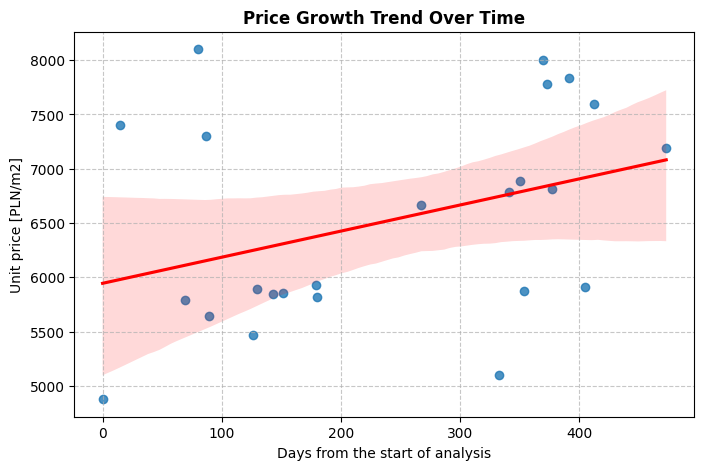
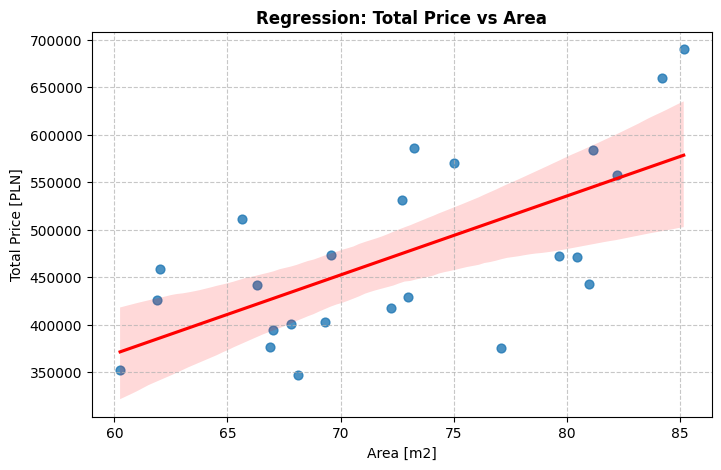
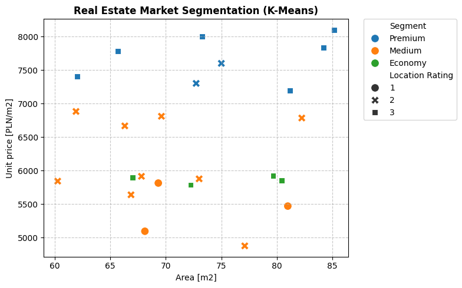
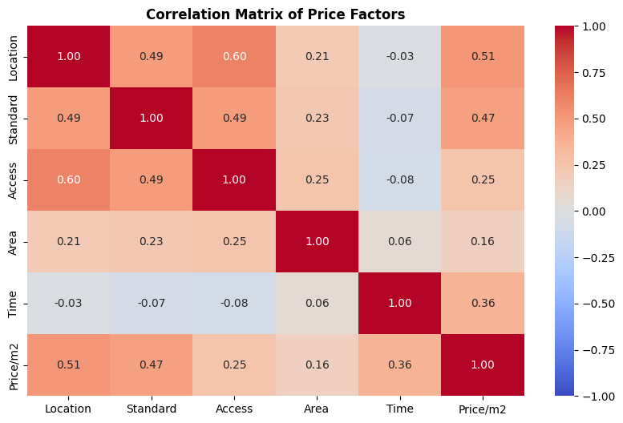

# Krakow Commercial Real Estate Market Analysis

## About the Project
This repository contains a comprehensive data analysis of the secondary market for commercial real estate in Krakow (data from 2017-2018). The objective of this project is to identify key factors influencing property prices, analyze market trends over time, and segment the market using Machine Learning techniques.

> **Translation Note:** The original analysis, business presentation, and source data were entirely created in Polish. To make this project accessible to a broader audience, I have translated the codebase, dataset headers, and the final presentation into English. Please note that some elements may still contain the original Polish text.

### Key Analytical Methods Used:
* **Time Trend Analysis:** Linear regression to estimate the daily and annual increase in property prices.
* **Simple & Multiple Linear Regression (OLS):** Using `statsmodels` to determine the exact financial impact of specific property features (e.g., location, finishing standard, accessibility) on the price per square meter.
* **K-Means Clustering:** Unsupervised machine learning (`scikit-learn`) used to segment the real estate market into three distinct categories: *Economy, Medium, and Premium*.
* **Correlation Analysis:** Heatmaps visualizing the interdependencies between various pricing factors.

## Dataset & Presentation
* **Data:** The analysis is based on real-world transaction data (`krakow_real_estate_data.xlsx`), containing variables such as transaction date, total price, unit price, usable area, location rating, finishing standard, and transport accessibility.
* **Business Insights:** A comprehensive presentation of the results, including data interpretation and market insights, is included in this repository as a PDF file.

## Technologies Used
- **Python 3.12.3**
- **Pandas & NumPy** (Data manipulation and aggregation)
- **Scikit-Learn** (K-Means clustering, Data scaling)
- **Statsmodels** (Ordinary Least Squares regression analysis)
- **Matplotlib & Seaborn** (Data visualization)

## How to Run the Project

1. **Clone the repository:**
   ```bash
   git clone https://github.com/zielantmagda/krakow-real-estate-analysis.git

2. **Navigate to the project directory:**
   ```bash
   cd krakow-real-estate-analysis

3. **Install the required dependencies:**
   ```bash
   pip install pandas numpy scikit-learn statsmodels matplotlib seaborn openpyxl

4. **Run the algorithm:**
   
	Make sure the `krakow_real_estate_data.xlsx` dataset file is located in the same directory as the main script!
   ```bash
   python krakow-real-estate-analysis.py

## Visualizations Generated
Running the script will automatically generate four highly informative plots:

1. Price Growth Trend Over Time (Linear regression plot)
   


3. Total Price vs. Area (Linear dependency)
   


5. Market Segmentation (K-Means scatter plot distinguishing Premium, Medium, and Economy segments)
   


7. Correlation Matrix (Heatmap of pricing factors)
   


## Contact & Contribution
This project was developed as a part of my geospatial computer science studies and personal portfolio. If you have any questions or suggestions, feel free to contact me. 😊
